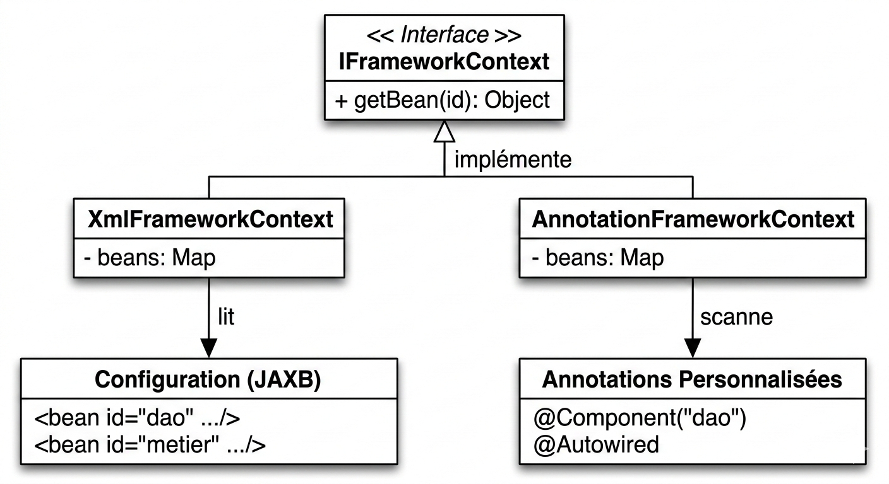

## Partie 2 : Création d'un mini-framework IoC & DI (Inversion of Control & Dependency Injection)

Dans cette partie, nous créons notre propre conteneur IoC from scratch (sans utiliser Spring) en exploitant la réflexion Java et la lecture XML via JAXB.
On cherche à réaliser le schéma suivant :

### 1. Architecture de base du framework
Pour respecter le principe "Ouvert à l'extension, fermé à la modification", nous créons une interface centrale que nos différents conteneurs (XML ou Annotations) devront implémenter.

```java
package ch.sohail.framework;

public interface IFrameworkContext {
    Object getBean(String id);
}

```

### 2. Création des annotations personnalisées

Nous définissons nos propres annotations pour permettre au framework d'identifier les composants et d'injecter les dépendances automatiquement. Celles-ci remplaceront celles de Spring.

```java
package ch.sohail.framework;

import java.lang.annotation.ElementType;
import java.lang.annotation.Retention;
import java.lang.annotation.RetentionPolicy;
import java.lang.annotation.Target;

@Retention(RetentionPolicy.RUNTIME)
@Target(ElementType.TYPE)
public @interface Component {
    String value() default "";
}

```

```java
package ch.sohail.framework;

import java.lang.annotation.ElementType;
import java.lang.annotation.Retention;
import java.lang.annotation.RetentionPolicy;
import java.lang.annotation.Target;

@Retention(RetentionPolicy.RUNTIME)
@Target({ElementType.FIELD, ElementType.CONSTRUCTOR, ElementType.METHOD})
public @interface Autowired {
}

```

### 3. Implémentation du conteneur via XML (JAXB & Reflection)

Cette classe joue le rôle de Factory Class dynamique. Elle utilise **JAXB** pour lire le fichier `config.xml` (Object XML Mapping), puis utilise l'**API Reflection** pour instancier les objets et injecter les dépendances.

On commence par modéliser les balises XML (`<beans>` et `<bean>`) :

```java
package ch.sohail.framework;

import javax.xml.bind.annotation.XmlAttribute;
import javax.xml.bind.annotation.XmlRootElement;

@XmlRootElement(name = "bean")
public class Bean {
    private String id;
    private String className;

    @XmlAttribute(name = "id")
    public String getId() { return id; }
    public void setId(String id) { this.id = id; }

    @XmlAttribute(name = "class")
    public String getClassName() { return className; }
    public void setClassName(String className) { this.className = className; }
}

```

```java
package ch.sohail.framework;

import java.util.ArrayList;
import java.util.List;
import javax.xml.bind.annotation.XmlElement;
import javax.xml.bind.annotation.XmlRootElement;

@XmlRootElement(name = "beans")
public class Beans {
    private List<Bean> beans = new ArrayList<>();

    @XmlElement(name = "bean")
    public List<Bean> getBeans() { return beans; }
    public void setBeans(List<Bean> beans) { this.beans = beans; }
}

```

Puis on crée le conteneur `XmlFrameworkContext` qui gère les 3 types d'injections (Constructeur, Attribut, Setter) :

```java
package ch.sohail.framework;

import java.io.File;
import java.lang.reflect.Constructor;
import java.lang.reflect.Field;
import java.lang.reflect.Method;
import java.util.HashMap;
import java.util.Map;
import javax.xml.bind.JAXBContext;
import javax.xml.bind.Unmarshaller;

public class XmlFrameworkContext implements IFrameworkContext {

    private Map<String, Object> beans = new HashMap<>();

    public XmlFrameworkContext(String xmlFilePath) {
        try {
            JAXBContext jaxbContext = JAXBContext.newInstance(Beans.class);
            Unmarshaller unmarshaller = jaxbContext.createUnmarshaller();
            Beans racineXml = (Beans) unmarshaller.unmarshal(new File(xmlFilePath));

            // 1. Création et Injection par constructeur
            for (Bean beanXml : racineXml.getBeans()) {
                Class<?> maClasse = Class.forName(beanXml.getClassName());
                Object monObjet = null;

                Constructor<?> constructeurAutowired = null;
                for (Constructor<?> constructeur : maClasse.getDeclaredConstructors()) {
                    if (constructeur.isAnnotationPresent(Autowired.class)) {
                        constructeurAutowired = constructeur;
                        break;
                    }
                }

                if (constructeurAutowired != null) {
                    Class<?>[] types = constructeurAutowired.getParameterTypes();
                    Object[] params = new Object[types.length];
                    for (int i = 0; i < types.length; i++) {
                        params[i] = trouverDependance(types[i]);
                    }
                    monObjet = constructeurAutowired.newInstance(params);
                } else {
                    monObjet = maClasse.newInstance();
                }
                beans.put(beanXml.getId(), monObjet);
            }

            // 2. Injection par Attribut (Field) et Setter
            for (Object beanInstance : beans.values()) {
                Class<?> clazz = beanInstance.getClass();

                // Field Injection
                for (Field field : clazz.getDeclaredFields()) {
                    if (field.isAnnotationPresent(Autowired.class)) {
                        Object dependance = trouverDependance(field.getType());
                        if (dependance != null) {
                            field.setAccessible(true);
                            field.set(beanInstance, dependance);
                        }
                    }
                }

                // Setter Injection
                for (Method method : clazz.getDeclaredMethods()) {
                    if (method.isAnnotationPresent(Autowired.class) && method.getParameterCount() == 1) {
                        Object dependance = trouverDependance(method.getParameterTypes()[0]);
                        if (dependance != null) {
                            method.invoke(beanInstance, dependance);
                        }
                    }
                }
            }
        } catch (Exception e) {
            e.printStackTrace();
        }
    }

    private Object trouverDependance(Class<?> typeRecherche) {
        for (Object obj : beans.values()) {
            if (typeRecherche.isAssignableFrom(obj.getClass())) return obj;
        }
        return null;
    }

    @Override
    public Object getBean(String id) {
        return beans.get(id);
    }
}

```

### 4. Implémentation via Annotations (Component Scanning)

Cette implémentation permet de se passer totalement du fichier XML. Le framework scanne directement les dossiers pour trouver les classes annotées avec `@Component`.

```java
package ch.sohail.framework;

import java.io.File;
import java.lang.reflect.Constructor;
import java.lang.reflect.Field;
import java.lang.reflect.Method;
import java.net.URL;
import java.util.ArrayList;
import java.util.HashMap;
import java.util.List;
import java.util.Map;

public class AnnotationFrameworkContext implements IFrameworkContext {

    private Map<String, Object> beans = new HashMap<>();

    public AnnotationFrameworkContext(String basePackage) {
        try {
            List<Class<?>> classesTrouvees = scannerPackage(basePackage);

            // Instanciation des classes avec @Component
            for (Class<?> clazz : classesTrouvees) {
                if (clazz.isAnnotationPresent(Component.class)) {
                    Component componentAnnotation = clazz.getAnnotation(Component.class);
                    String beanId = componentAnnotation.value().isEmpty() ? clazz.getSimpleName().toLowerCase() : componentAnnotation.value();

                    Object monObjet = clazz.newInstance(); // Simplifié pour l'exemple
                    beans.put(beanId, monObjet);
                }
            }

            // Injection des dépendances (Fields & Setters)
            for (Object beanInstance : beans.values()) {
                Class<?> clazz = beanInstance.getClass();
                
                for (Field field : clazz.getDeclaredFields()) {
                    if (field.isAnnotationPresent(Autowired.class)) {
                        Object dependance = trouverDependance(field.getType());
                        if (dependance != null) {
                            field.setAccessible(true);
                            field.set(beanInstance, dependance);
                        }
                    }
                }
            }
        } catch (Exception e) {
            e.printStackTrace();
        }
    }

    private Object trouverDependance(Class<?> typeRecherche) {
        for (Object obj : beans.values()) {
            if (typeRecherche.isAssignableFrom(obj.getClass())) return obj;
        }
        return null;
    }

    private List<Class<?>> scannerPackage(String packageName) throws Exception {
        List<Class<?>> classes = new ArrayList<>();
        String path = packageName.replace('.', '/');
        URL resource = Thread.currentThread().getContextClassLoader().getResource(path);
        if (resource != null) {
            File directory = new File(resource.getFile());
            if (directory.exists()) {
                for (File file : directory.listFiles()) {
                    if (file.getName().endsWith(".class")) {
                        classes.add(Class.forName(packageName + '.' + file.getName().replace(".class", "")));
                    }
                }
            }
        }
        return classes;
    }

    @Override
    public Object getBean(String id) {
        return beans.get(id);
    }
}

```

### 5. Application et Tests

Pour tester, on prépare notre DAO et Métier avec **nos propres annotations** créées plus haut.

**DaoImpl.java**

```java
package ch.sohail.dao;
import ch.sohail.framework.Component;

@Component("dao")
public class DaoImpl implements IDao {
    @Override
    public double getData() {
        return 100.0;
    }
}

```

**MetierImpl.java**

```java
package ch.sohail.metier;
import ch.sohail.dao.IDao;
import ch.sohail.framework.Autowired;
import ch.sohail.framework.Component;

@Component("metier")
public class MetierImpl implements IMetier {
    @Autowired
    private IDao dao; 

    @Override
    public double calcul() {
        return dao.getData() * 2.5;
    }
}

```

#### Test via XML

On configure notre fichier `src/main/resources/config.xml` :

```xml
<?xml version="1.0" encoding="UTF-8"?>
<beans>
    <bean id="dao" class="ch.sohail.dao.DaoImpl" />
    <bean id="metier" class="ch.sohail.metier.MetierImpl" />
</beans>

```

```java
package ch.sohail.pres;

import ch.sohail.framework.IFrameworkContext;
import ch.sohail.framework.XmlFrameworkContext;
import ch.sohail.metier.IMetier;

public class PresXMLCustom {
    public static void main(String[] args) {
        IFrameworkContext context = new XmlFrameworkContext("src/main/resources/config.xml");
        IMetier metier = (IMetier) context.getBean("metier");
        System.out.println("Résultat (XML Custom) = " + metier.calcul());
    }
}

```

#### Test via Annotations

```java
package ch.sohail.pres;

import ch.sohail.framework.IFrameworkContext;
import ch.sohail.framework.AnnotationFrameworkContext;
import ch.sohail.metier.IMetier;

public class PresAnnotationCustom {
    public static void main(String[] args) {
        IFrameworkContext context = new AnnotationFrameworkContext("ch.sohail");
        IMetier metier = (IMetier) context.getBean("metier");
        System.out.println("Résultat (Annotation Custom) = " + metier.calcul());
    }
}

```
