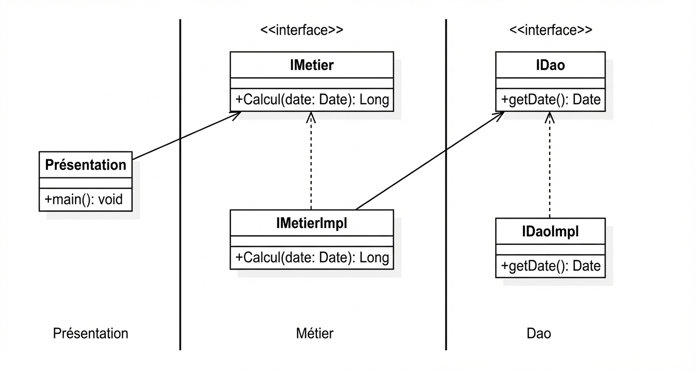

## Partie 1 : Application du support et vidéo

### 1. Schématisation du problème
On cherche à réaliser le schéma suivant :

### 2. Couche DAO
On crée l'interface IDao

```java
package ch.sohail.dao;

public interface IDao {
    double getData();
}
```

Puis son implémentation dans DaoImpl

```java
package ch.sohail.dao;

import org.springframework.stereotype.Component;

@Component("d")
public class DaoImpl implements IDao {

    @Override
    public double getData() {
        System.out.println("Version base de donnees");
        double t = 40;
        return t;
    }
}
```

### 3. Couche métier
On crée l'interface IMetier

```java
package ch.sohail.metier;

public interface IMetier {
    double calcul();
}
```

Puis son implémentation dans MetierImpl en utilisant un couplage faible

```java
package ch.sohail.metier;

import ch.sohail.dao.IDao;
import org.springframework.beans.factory.annotation.Autowired;
import org.springframework.beans.factory.annotation.Qualifier;
import org.springframework.stereotype.Component;

@Component("metier")
public class MetierImpl implements IMetier {
    //@Autowired
   //@Qualifier("d2")
    private IDao dao; // Couplage faible

    /**
     * Pour injecter dans l'attribut dao
     * un objet d'une classe qui implement l'interface IDao
     * au moment de la creation de l'objet (l'instantiation)
     */
    public MetierImpl(@Qualifier("d") IDao dao) {
        this.dao = dao;
    }

//    public MetierImpl() {
//
//    }

    @Override
    public double calcul() {
        double t = dao.getData();
        double result = t * 0.5; // regle metier
        return result;
    }

    /**
     * Pour injecter dans l'attribut dao
     * un objet d'une classe qui implement l'interface IDao
     * apres instantiation
     */
    public void setDao(IDao dao) {
        this.dao = dao;
    }
}
```

### 4. Injection des dépendances
Maintenant afin d'assurer la communication entre la classe ImetierImpl et Dao, il faut injecter la dépendance. Ceci peut se réaliser à travers 2 méthodes :

#### Instanciation statique
Dans la couche présentation, on crée une classe Pres1 où on appliquera une injection statique des dépendances.

**Note :** Cette classe joue le rôle de Factory Class, elle génère les dépendances.

```java
package ch.sohail.pres;

import ch.sohail.ext.DaoImplV2;
import ch.sohail.dao.DaoImpl;
import ch.sohail.metier.MetierImpl;

public class Pres1 {
    public static void main(String[] args) {
        DaoImplV2 dao = new DaoImplV2();
        MetierImpl metier = new MetierImpl(dao);
        //metier.setDao(dao); // Injection des dependances via le setter
        System.out.println("MetierImpl calcul : " + metier.calcul());
    }
}
```

#### Instanciation dynamique
Toujours dans le contexte de « code ouvert à l'extension et fermé à la modification » , l'instanciation statique nous oblige à modifier le code au cas où on crée une nouvelle extension. Instanciation dynamique par contre injecte automatiquement les dépendances sans changer de codes. Il suffit de modifier le fichier config.txt.

```java
package ch.sohail.pres;

import ch.sohail.dao.IDao;
import ch.sohail.metier.IMetier;

import java.io.File;
import java.io.FileNotFoundException;
import java.lang.reflect.InvocationTargetException;
import java.lang.reflect.Method;
import java.util.Scanner;

public class Pres2 {
    public static void main(String[] args) throws FileNotFoundException, ClassNotFoundException, InstantiationException, IllegalAccessException, NoSuchMethodException, InvocationTargetException {
        Scanner sc = new Scanner(new File("config.txt"));

        String daoClassName = sc.nextLine();
        Class cDao = Class.forName(daoClassName);
        IDao dao = (IDao) cDao.newInstance();

        String metierClassName = sc.nextLine();
        Class cMetier = Class.forName(metierClassName);
        IMetier metier = (IMetier) cMetier.getConstructor(IDao.class).newInstance(dao);
//        IMetier metier = (IMetier) cMetier.getConstructor().newInstance();
//        Method setDao = cMetier.getDeclaredMethod("setDao", IDao.class);
//        setDao.invoke(metier, dao);
        System.out.println("RES="+metier.calcul());
    }

}
```

Le fichier config.txt contient les noms et chemin des classes utilisées.

```
ch.sohail.ext.DaoImplV2
ch.sohail.metier.MetierImpl
```

### 5. Framework Spring
Pour cette partie on exploite le framework Spring pour injecter les dépendances automatiquement :

#### Par XML
Class PresSpringXML

```java
package ch.sohail.pres;

import ch.sohail.metier.IMetier;
import org.springframework.context.ApplicationContext;
import org.springframework.context.support.ClassPathXmlApplicationContext;

public class PresSpringXML {
    public static void main(String[] args){
        ApplicationContext springContext = new ClassPathXmlApplicationContext("config.xml");

        IMetier metier = springContext.getBean(IMetier.class);
        System.out.println("RES="+metier.calcul());
    }
}
```

Voici la structure du fichier config.xml

```xml
<?xml version="1.0" encoding="UTF-8"?>
<beans xmlns="http://www.springframework.org/schema/beans"
       xmlns:xsi="http://www.w3.org/2001/XMLSchema-instance"
       xsi:schemaLocation="http://www.springframework.org/schema/beans http://www.springframework.org/schema/beans/spring-beans.xsd">

    <bean id="d" class="ch.sohail.dao.DaoImpl"></bean>
    <bean id="metier" class="ch.sohail.metier.MetierImpl">
<!--        <property name="dao" ref="d"></property>-->
        <constructor-arg ref="d"></constructor-arg>

    </bean>
</beans>
```

#### Par annotations
Class PresSpringAnnotation

```java
package ch.sohail.pres;

import ch.sohail.metier.IMetier;
import org.springframework.context.ApplicationContext;
import org.springframework.context.annotation.AnnotationConfigApplicationContext;

public class PresSpringAnnotation {
    public static void main(String[] args) {

        ApplicationContext applicationContext = new AnnotationConfigApplicationContext("ch.sohail");
        IMetier metier = applicationContext.getBean(IMetier.class);
        System.out.println("Res=" + metier.calcul());
    }
}
```
